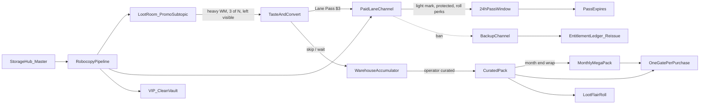

# Loot Room Lane Economy — Product Bible

**Status:** Scaffold (docs + constants). Payment SKUs / workers not wired yet.  
**Last updated:** 2026-07-17  
**Verdict:** Ship with changes — see § Red lines.

**One-line brand:** AOF is a Telegram loot economy — automated scarcity that turns every media drop into a timed choice: taste the promo, buy a pass, or wait for the sealed pack.

**See also:** [`MEDIA_GATEKEEPER.md`](MEDIA_GATEKEEPER.md) — purification sorter (quarantine / quality score) before public pools and Loot Room spectacle.

---

## Roles

| Surface | Job |
|---------|-----|
| **Loot Room (hub)** | Ticket booth + promo stage. Per-lane **subtopics** only when the lane is **ready** (§ Channel readiness). Daily samples. Not the archive. |
| **Lane (official channel)** | Protected destination after Lane Pass. Light watermark. Roll perks for 24h — not clean forwards. |
| **Storage Hub** | Ops warehouse (master media). Source of truth before public surfaces. |
| **Curated Pack** | Operator-curated sealed dump (theme-led; size band ~250–400 when sealed). |
| **Monthly MEGA PACK** | Sum of that month's curated packs, wrapped once per lane (or network) at month end. |
| **Backup channel** | Pre-seeded insurance mirror. Ledger re-seats buyers on ban. |

---

## Canonical cycle



**Per-lane pipeline:** Identical mechanics, different content. Casino floor with themed tables.

---

## Watermark tiers (locked)

| Surface | Watermark | Forwards | Content | Job |
|---------|-----------|----------|---------|-----|
| **Glimpse / Promo** | Heavy / gratuitous (brand + @bot) | Enabled (leak = ad) | Reduced album (e.g. 3 of 7), **left visible** | Taste + permanent conversion + free distribution when leaked |
| **Lane Pass channel** | Light corner mark | **Protected (OFF)** | Full set for that drop | 24h access + roll eligibility |
| **VIP / vault** | None | Protected | Clean masters | Whale endgame |
| **Backup** | Same as primary tier | Same as primary | Continuity only | Insurance landing |

**Red line:** No tier that is **clean + forwardable + paid**. Clean = protected. Forwardable = at least light mark.

**Robocopy:** One master → promo (heavy) + lane (light) + vault (clean). Automate this before the glimpse poster.

```powershell
cd tbcc/backend
py -3.13 scripts/robocopy_watermark_cli.py --show-configs
py -3.13 scripts/robocopy_watermark_cli.py --master PATH\to\masters --out PATH\to\out --dry-run
py -3.13 scripts/robocopy_watermark_cli.py --master PATH\to\masters --out PATH\to\out --execute
```

Service: `backend/app/services/robocopy_watermark.py` (`apply_config_for_tier`, `fan_out_master_folder`).

---

## Lane readiness audit

```powershell
cd tbcc/backend
py -3.13 scripts/audit_lane_readiness.py
```

Service: `backend/app/services/lane_readiness.py`. Sorted by scrape gap to median (images+videos).

---

## Shop SKUs (seed)

Idempotent via `scripts/seed_aof_shop_and_loot.py` (`seed_lane_economy_skus`):

| Name | Section | USD | Stars (@ $0.012) |
|------|---------|-----|------------------|
| Lane Pass — 24h | loot | $3 | 250 |
| Curated Pack | packs | $12 | 1000 |
| Monthly MEGA PACK | packs | $25 | 2084 |

Zip fulfillment / per-lane invite automation still future work — rows appear in payment bot `/packs` / `/loot` once seeded.

| SKU | Price | What buyer gets | Roll advantage |
|-----|-------|-----------------|----------------|
| **Lane Pass** | **$3** one-time | Single lane, 24h, protected light-mark channel | Base roll eligibility |
| **Loot God 24h key** | $5–8 | Game + rolls across pools | Standard odds |
| **Curated Pack** | **$12** one-time | Operator-curated sealed pack + Loot Flair | Better flair odds |
| **Monthly MEGA PACK** | **$25** one-time | Wrap of that month's curated packs | Best one-shot odds |
| **VIP** | $20+/mo | All lanes, packs, priority | Best odds + clean vault |

**Rules:**
- Higher tier = better **roll odds**, not just more files. Files leak; odds don't.
- Lane Pass is the weakest access tier.
- **One friction wall per purchase** (never stack Linkvertise + pass + pack gate on the same buy).
- Funnel weight: **Curated Pack → monthly MEGA** is primary revenue; glimpse + $3 pass = top-of-funnel.

### Curated packs (operator workflow)

- Operator sets aside time before a deadline and **curates** a pack (theme-led).
- Prefer curation proof in copy ("MILF Week 12 · 287 curated") over raw "400 items."
- Soft seal band: **250–400** items when a curated pack ships (guidance, not a hard bot rule yet).
- At month end, **all curated packs** for that period wrap into one **MEGA PACK**.

---

## Zip flywheel (v1 — 2026-07-17)

**Locked:** Hybrid host (R2 small/SFW + Pixeldrain large) for single files **and** folders (folder → zip first).  
**Destinations this pass:** (1) Downloads promo name (2) Host→gated clipboard (3) Loot modifier (5) Curated Pack shop SKU.  
**Deferred:** (4) inbox/watch.

| Piece | Path |
|-------|------|
| API | `POST /import/zip-flywheel` |
| Service | `zip_flywheel.py` + `pixeldrain_upload.py` |
| Ext | Gallery ZIP dropdown + progress bar **top**; `TbccZipNaming.buildDestinationFilename` |
| Env | `TBCC_PIXELDRAIN_API_KEY`, R2 keys, optional `TBCC_ZIP_FLYWHEEL_R2_MAX_BYTES` (default 40MiB) |

Watermark strip/crop remains optional and non-destructive (copy only); not required for flywheel money path.

---

## Channel readiness (Loot Room subtopic gate)

A lane gets its **own Loot Room forum subtopic** only when media depth is credible.

| Threshold | Images | Videos | Meaning |
|-----------|--------|--------|---------|
| **Minimum to open subtopic** | **2,500** | **2,500** | Per format, per category/lane |
| **Target median** | **5,000+** | **5,000+** | Scraper cadence may tick up until lanes hit this |
| **Aspirational** | **10,000** | **10,000** | Preferred depth per channel |

**Scraper note:** Slight increase in scrape intensity is acceptable to bring all lanes toward median **5,000+** images and **5,000+** videos respectively — without sacrificing tagging/quality gates that feed packs.

Until ready: lane still runs in Storage Hub + official channel; **no** dedicated Loot Room promo subtopic.

---

## Recovery policy

**Keep:** Pre-seeded backup channels; calm-period "join backup" drips; **real** ban alerts only; positive invite-for-roll loops; **entitlement ledger** in bot DB (re-issue invites on ban).

**Cut:** Fake "share or get banned"; fake abuse banners (poison Loot God trust + report magnets).

---

## Public copy spine

1. *3 of 7 shown in Loot Room — [LANE] checkpoint. Heavy mark. Pass unlocks the set.*
2. *Lane Pass $3 · 24 hours · one door · protected channel + roll perks.*
3. *Sitting it out? It joins the Warehouse. Curated Pack this week. MEGA at month end. Members-only vault.*
4. *Free taste of the game: @aof_lootgod_bot — not the library.*

**Internal doctrine:** Library stays paid.  
**Public framing:** Members-only vault — not "nothing free by design."

---

## Lane Drop Checkpoint (merch review)

Human gate **after** robocopy fan-out, **before** content hits the dedicated lane channel / Loot Room subtopic.

| Step | What happens |
|------|----------------|
| Masters land | Storage Hub / watch / zip flywheel |
| Fan-out | `promo_heavy` / `lane_light` / `vault_clean` |
| **Checkpoint** | `POST /lane-drops` → status `pending_checkpoint` |
| Approve | `POST /lane-drops/{id}/approve` — ready for glimpse post (not auto in v1) |
| Reject | `POST /lane-drops/{id}/reject` — warehouse / curated pack queue |

Model: `lane_drops` (alembic `094`). Service: `lane_drop_checkpoint.py`. List pending: `GET /lane-drops?status=pending_checkpoint`.

---

## Build phases

| Phase | Scope |
|-------|-------|
| **P0** | Entitlement ledger + backup channel registry |
| **P0.5** | Robocopy pipeline — **CLI live** (`robocopy_watermark_cli.py`) |
| **P1** | Curated Pack + Monthly MEGA + Lane Pass **shop rows** — seed live; zip/fulfill later |
| **P1.5** | Lane Drop Checkpoint scaffold (`/lane-drops`) — approve before glimpse |
| **P2** | Visible glimpse (3-of-N, heavy WM) — only for **ready** lanes |
| **P3** | Dynamic one-use 24h invite + protected channel post for Lane Pass |
| **P4** | Pass window = roll perks only (not clean forwards) |
| **P5** | Ban → ledger re-issue + real backup FOMO |

**Scaffold (this pass):** docs + constants + readiness audit + robocopy CLI + shop SKU seed. No Celery / GHCR.

---

## Red lines

- Clean + forwardable + paid in any tier.
- No entitlement ledger independent of Telegram channels.
- Stacked mandatory gates on one purchase.
- Public "nothing free by design" on cold traffic.
- Volume-only pack marketing with no curation signal.
- Fake coercion virality or fake abuse banners.
- Building pass SKU before pack SKU + robocopy.
- Opening a Loot Room subtopic before **2,500 images and 2,500 videos** for that lane.

---

## Code map

| Artifact | Path |
|----------|------|
| Constants | `backend/app/data/loot_lane_economy.py` |
| Checkpoint | `backend/app/services/lane_drop_checkpoint.py` + `GET/POST /lane-drops` |
| Readiness audit | `backend/app/services/lane_readiness.py` + `scripts/audit_lane_readiness.py` |
| Island snapshot | `docs/LANE_READINESS_AUDIT.md` |
| Robocopy WM | `backend/app/services/robocopy_watermark.py` + `scripts/robocopy_watermark_cli.py` |
| Shop seed | `scripts/seed_aof_shop_and_loot.py` (`seed_lane_economy_skus`) |
| Network lanes | `backend/app/data/aof_network.py` |
| Hub topic map | `backend/app/data/aof_main_group_topic_map.py` |
| Pinned / quick copy | `docs/loot-room-pinned-instructions.md`, `docs/AOF_QUICK_COPY_HUB.md` |

