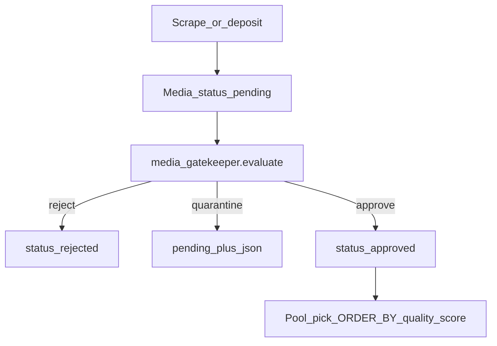

# Media Gatekeeper — Product & Policy Bible

**Status:** Spec locked (docs + frozen constants). Worker / deposit hook not wired yet.  
**Last updated:** 2026-07-21  
**Code:** `backend/app/data/media_gatekeeper_spec.py`

**One-line:** A lightweight purification sorter — metadata globs + quality score — that rejects trash, quarantines ambiguity, and only auto-approves trusted resellable peaks.

---

## Doctrine (locked)

1. **Scrape-origin never auto-approves** until the source is on the trust list.
2. **Age / seller-proof / zoo signals never yield `approve`.** Human iron fist on ambiguity.
3. **Operator rejects feed source demotion** (reject streak → deactivate SCRP peer; wiring is next slice).
4. **`quality_score` (0–100)** ranks resellable inventory; trash never gets `approved`.
5. **Pilot lane** for implementation = ASS; rules in this doc are **network-agnostic**.

**Vision LLM is never the judge** for age, zoo, or illegal content. NSFW/CLIP sidecars are optional **signals** into quality/lane_fit only.

---

## Placement in the pipeline



Runs **before** public pools, schedulers, and Loot Room spectacle. See also: `docs/LOOT_LANE_ECONOMY.md` (downstream funnel).

---

## Outcomes (three only)

Maps onto existing `media.status` — no migration.

| Verdict | DB effect | Meaning |
|---------|-----------|---------|
| `reject` | `status=rejected` | Auto trash / clear hard block (zoo, spam, duplicates) |
| `quarantine` | `status=pending` + `classification_json.gatekeeper.verdict=quarantine` | Human must decide |
| `approve` | `status=approved` + `quality_score` in JSON | Trusted source + score ≥70 + no age/seller flags |

Full breakdown stored under `classification_json.gatekeeper` (merge; never wipe other keys).

### JSON shape

```json
{
  "gatekeeper": {
    "verdict": "quarantine",
    "quality_score": 52,
    "blocks": ["hard_block:age_adjacent"],
    "warnings": ["lane_fit:mismatch"],
    "boosts": ["quality:explicit_tier"],
    "globs": {
      "hard_block": {"pass": false, "flags": ["age_adjacent"]},
      "trash": {"pass": true},
      "lane_fit": {"pass": false, "expected": "milf", "detected": "ass"},
      "quality": {"pass": false, "score": 52},
      "enrich": {"nsfw_tier": "explicit", "clip_confident": true}
    }
  }
}
```

Python symbols: `MediaVerdict`, `evaluate_media()` in `media_gatekeeper_spec.py`.

---

## Five globs

Evaluation order: **hard_block → trash → lane_fit → quality → enrich → aggregate**.

### Glob 1 — `hard_block`

Metadata only (caption, filename, source id). No vision LLM.

| Signal class | Patterns (see `AGE_ADJACENT_PATTERNS`, etc.) | Outcome |
|--------------|---------------------------------------------|---------|
| Age-adjacent | underage, jailbait, loli, shota, teen-age in seller context | **quarantine** — never approve |
| Seller-proof UI | seller, proof, verify, menu, rates (+ screenshot aspect when known) | **quarantine** |
| Zoo / bestiality | `ZOO_KEYWORD_PATTERNS` | **reject** |
| Known-bad source | `SKIP_INBOUND_CHAT_IDS` + `GATEKEEPER_BANNED_SOURCE_IDS` | **reject** |

False-negative risk on age → **quarantine over approve**. Tune lists after pilot; do not auto-approve to fix volume.

### Glob 2 — `trash`

Auto-reject, no human.

| Rule | Threshold constant |
|------|-------------------|
| Non-media type | document, sticker, voice, audio |
| Duplicate in pool | `is_duplicate_in_pool=True` |
| Photo too small | shortest side `<480` OR filesize `<200KB` when known |
| Video too short | duration `<3s` when known |
| URL/handle spam caption | `≥80%` of caption tokens are URLs/handles |
| Competitor watermark | `COMPETITOR_WATERMARK_PATTERNS` (AOF handles exempt) |

### Glob 3 — `lane_fit`

Inputs: `expected_lane`, caption hashtags, optional CLIP slug (`clip_confident`).

| Condition | Effect |
|-----------|--------|
| Match confident | pass + quality boost |
| Mismatch confident | **quarantine** (do not auto-delete; reroute later) |
| Unknown / low confidence | mild quality penalty (−5) |

Uses same lane keys as `aof_lane_tag_map.py` / `aof_network.py`.

### Glob 4 — `quality` (0–100)

Base score: **50**. Clamped 0–100. Missing metadata = neutral (0 delta), not fail-open.

**Boosts** (`QUALITY_BOOST_*`):

| Signal | Points |
|--------|--------|
| Vertical short video 5–60s | +25 |
| Trusted source | +20 |
| `nsfw_tier=explicit` | +15 |
| CLIP confident + lane-aligned | +15 |
| Resolution ≥720p (shortest side) | +10 |
| Known model hashtag in caption | +10 |

**Penalties** (`QUALITY_PENALTY_*`):

| Signal | Points |
|--------|--------|
| Letterbox / horizontal garbage | −20 |
| `suggestive` only (not explicit) | −10 |
| Unknown / first-seen source | −5 |
| Lane mismatch (from glob 3) | handled via quarantine |

**Thresholds** (`SCORE_*`):

| Score | Plus gates | Verdict |
|-------|------------|---------|
| ≥70 | trusted source AND no age/seller hard_block | `approve` |
| ≥70 | untrusted / new source | `quarantine` |
| 40–69 | any | `quarantine` |
| <40 | any | `reject` |
| any age/seller hard_block | — | `quarantine` (overrides approve) |
| zoo hard_block | — | `reject` |

### Glob 5 — `enrich` (optional signals)

Documents how sidecar results feed globs 3–4 when present:

- `TBCC_NSFW_DETECT_URL` → `nsfw_tier` for quality boost/penalty
- `TBCC_CLIP_CATEGORIZE_URL` → lane slug for lane_fit when confident

Missing enrich → proceed on metadata only. **Do not block** the pipeline waiting for LLM.

---

## Worked examples

| # | Input (summary) | Globs | Verdict |
|---|-----------------|-------|---------|
| 1 | Seller-proof screenshot, age-adjacent caption | hard_block age+seller | **quarantine** — never approve |
| 2 | 7s vertical clip, `#modelname`, ASS lane, explicit, trusted | quality ~85 | **approve** |
| 3 | ASS content deposited to MILF topic, otherwise clean | lane_fit mismatch | **quarantine** |
| 4 | 2s video, URL-wall caption | trash duration+spam | **reject** |

Covered by `tests/test_media_gatekeeper_spec.py`.

---

## Source trust

| State | Auto-approve allowed? |
|-------|----------------------|
| `source_trusted=True` | Yes, if score ≥70 and no age/seller flags |
| `source_trusted=False` (default for scrape) | No — score ≥70 still → **quarantine** |

Trust list wiring (DB / operator approve-N-from-source) is next implementation slice.

---

## Operator reject → source demotion (documented; not wired)

After **K consecutive rejects** from the same `source_channel_id` (default K=5), deactivate the SCRP source row and add chat id to ban set. Prevents one bad channel from flooding quarantine.

---

## Red lines

- Vision LLM as judge for age / zoo / illegal content.
- Auto-approve scrape-origin without trust.
- Auto-approve when age-adjacent or seller-proof flags fire.
- Wiping `classification_json` on gatekeeper run (merge only).
- Real CSAM samples in tests or docs.

---

## Code map

| Artifact | Path |
|----------|------|
| Frozen constants + `evaluate_media()` | `backend/app/data/media_gatekeeper_spec.py` |
| Unit tests | `backend/tests/test_media_gatekeeper_spec.py` |
| Skip list hook | `backend/app/data/aof_scrape_inbound_map.py` (`SKIP_INBOUND_CHAT_IDS`) |
| Lane tags | `backend/app/services/aof_lane_tag_map.py` |
| NSFW / CLIP sidecars | `nsfw_classifier.py`, `clip_classifier.py` |

---

## Build phases

| Phase | Scope | Status |
|-------|-------|--------|
| **P0** | This doc + frozen spec + tests | **Done** |
| **P1** | Celery hook on deposit/scrape + kill scrape auto-approve | **Done** (`media_gatekeeper.py`, ingest hooks) |
| **P1b** | ASS SCRP micro-pull → Storage Hub | **Done** (`scrape_micro_pull.py`, Beat when `TBCC_SCRAPE_MICRO_PULL_ENABLED=1`) |

### Env (micro-pull)

| Variable | Default | Meaning |
|----------|---------|---------|
| `TBCC_SCRAPE_MICRO_PULL_ENABLED` | `0` | Celery Beat tick every 2h (ASS lane) |
| `TBCC_SCRAPE_MICRO_PULL_LANE` | `ass` | Pilot lane key |
| `TBCC_SCRAPE_MICRO_PULL_LIMIT` | `10` | Messages per source per run |
| `TBCC_MEDIA_GATEKEEPER_ENABLED` | `1` | Run `evaluate_media()` on ingest |

CLI: `py -3.13 scripts/run_scrape_micro_pull.py --lane ass --execute`
| **P2** | Quarantine Telegram review buttons | **Done** (`gatekeeper_review.py`, `gk:a` / `gk:r` on Album Composer) |
| **P3** | Source demote on reject streak | **Done** (`gatekeeper_source_demote.py`, default streak 5) |

### Env (review + demote)

| Variable | Default | Meaning |
|----------|---------|---------|
| `TBCC_GATEKEEPER_REVIEW_NOTIFY` | `1` | Post review card on quarantine |
| `TBCC_GATEKEEPER_REVIEW_CHAT_ID` | Storage Hub id | Where review cards post |
| `TBCC_GATEKEEPER_REVIEW_THREAD_ID` | (unset) | Optional forum thread for review queue |
| `TBCC_GATEKEEPER_DEMOTE_STREAK` | `5` | Operator rejects before SCRP source demote |

Buttons: **✅ Approve** / **🗑 Reject** on review card (Album Composer bot, admin-only).
| **P4** | Quality-ranked pool / loot picks | Next |
