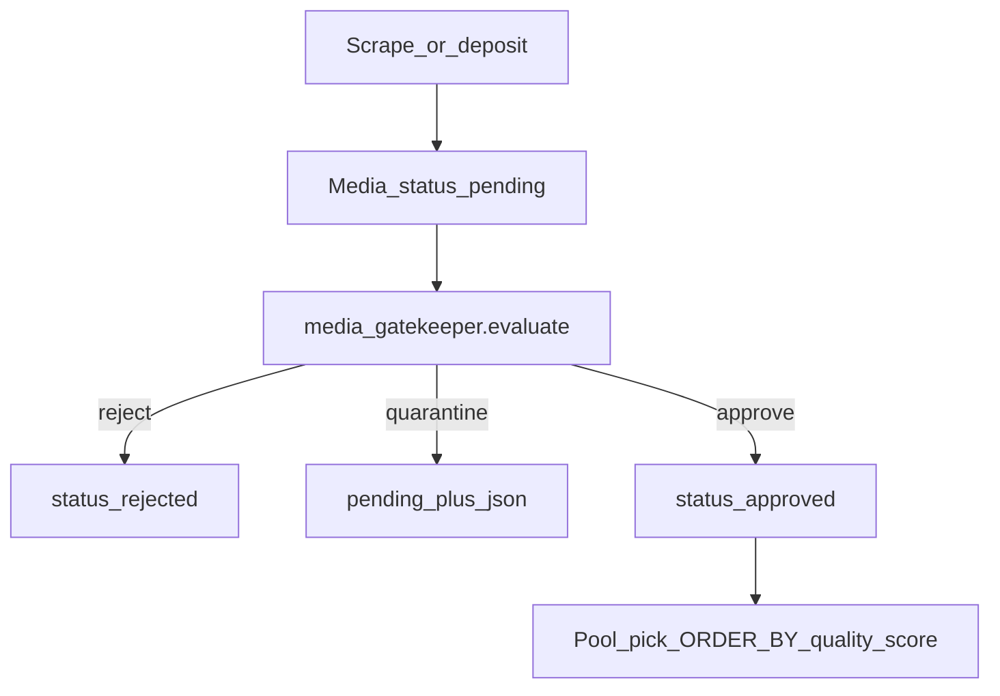

# Media Gatekeeper — Product & Policy Bible

**Status:** Spec locked (docs + frozen constants). Worker / deposit hook not wired yet.  
**Last updated:** 2026-07-21  
**Code:** `backend/app/data/media_gatekeeper_spec.py`

**One-line:** A lightweight purification sorter — metadata globs + quality score — that rejects trash, quarantines ambiguity, and only auto-approves trusted resellable peaks.

---

## Doctrine (locked)

1. **Scrape-origin never auto-approves** until the source is on the trust list.
2. **Age / seller-proof / zoo signals never yield `approve`.** Human iron fist on ambiguity.
3. **Operator rejects feed source demotion** (reject streak → deactivate SCRP peer; wiring is next slice).
4. **`quality_score` (0–100)** ranks resellable inventory; trash never gets `approved`.
5. **Pilot lane** for implementation = ASS; rules in this doc are **network-agnostic**.

**Vision LLM is never the judge** for age, zoo, or illegal content. NSFW/CLIP sidecars are optional **signals** into quality/lane_fit only.

---

## Placement in the pipeline



Runs **before** public pools, schedulers, and Loot Room spectacle. See also: `docs/LOOT_LANE_ECONOMY.md` (downstream funnel).

---

## Outcomes (three only)

Maps onto existing `media.status` — no migration.

| Verdict | DB effect | Meaning |
|---------|-----------|---------|
| `reject` | `status=rejected` | Auto trash / clear hard block (zoo, spam, duplicates) |
| `quarantine` | `status=pending` + `classification_json.gatekeeper.verdict=quarantine` | Human must decide |
| `approve` | `status=approved` + `quality_score` in JSON | Trusted source + score ≥70 + no age/seller flags |

Full breakdown stored under `classification_json.gatekeeper` (merge; never wipe other keys).

### JSON shape

```json
{
  "gatekeeper": {
    "verdict": "quarantine",
    "quality_score": 52,
    "blocks": ["hard_block:age_adjacent"],
    "warnings": ["lane_fit:mismatch"],
    "boosts": ["quality:explicit_tier"],
    "globs": {
      "hard_block": {"pass": false, "flags": ["age_adjacent"]},
      "trash": {"pass": true},
      "lane_fit": {"pass": false, "expected": "milf", "detected": "ass"},
      "quality": {"pass": false, "score": 52},
      "enrich": {"nsfw_tier": "explicit", "clip_confident": true}
    }
  }
}
```

Python symbols: `MediaVerdict`, `evaluate_media()` in `media_gatekeeper_spec.py`.

---

## Five globs

Evaluation order: **hard_block → trash → lane_fit → quality → enrich → aggregate**.

### Glob 1 — `hard_block`

Metadata only (caption, filename, source id). No vision LLM.

| Signal class | Patterns (see `AGE_ADJACENT_PATTERNS`, etc.) | Outcome |
|--------------|---------------------------------------------|---------|
| Age-adjacent | underage, jailbait, loli, shota, teen-age in seller context | **quarantine** — never approve |
| Seller-proof UI | seller, proof, verify, menu, rates (+ screenshot aspect when known) | **quarantine** |
| Zoo / bestiality | `ZOO_KEYWORD_PATTERNS` | **reject** |
| Known-bad source | `SKIP_INBOUND_CHAT_IDS` + `GATEKEEPER_BANNED_SOURCE_IDS` | **reject** |

False-negative risk on age → **quarantine over approve**. Tune lists after pilot; do not auto-approve to fix volume.

### Glob 2 — `trash`

Auto-reject, no human.

| Rule | Threshold constant |
|------|-------------------|
| Non-media type | document, sticker, voice, audio |
| Duplicate in pool | `is_duplicate_in_pool=True` |
| Photo too small | shortest side `<480` OR filesize `<200KB` when known |
| Video too short | duration `<3s` when known |
| URL/handle spam caption | `≥80%` of caption tokens are URLs/handles |
| Competitor watermark | `COMPETITOR_WATERMARK_PATTERNS` (AOF handles exempt) |

### Glob 3 — `lane_fit`

Inputs: `expected_lane`, caption hashtags, optional CLIP slug (`clip_confident`).

| Condition | Effect |
|-----------|--------|
| Match confident | pass + quality boost |
| Mismatch confident | **quarantine** (do not auto-delete; reroute later) |
| Unknown / low confidence | mild quality penalty (−5) |

Uses same lane keys as `aof_lane_tag_map.py` / `aof_network.py`.

### Glob 4 — `quality` (0–100)

Base score: **50**. Clamped 0–100. Missing metadata = neutral (0 delta), not fail-open.

**Boosts** (`QUALITY_BOOST_*`):

| Signal | Points |
|--------|--------|
| Vertical short video 5–60s | +25 |
| Trusted source | +20 |
| `nsfw_tier=explicit` | +15 |
| CLIP confident + lane-aligned | +15 |
| Resolution ≥720p (shortest side) | +10 |
| Known model hashtag in caption | +10 |

**Penalties** (`QUALITY_PENALTY_*`):

| Signal | Points |
|--------|--------|
| Letterbox / horizontal garbage | −20 |
| `suggestive` only (not explicit) | −10 |
| Unknown / first-seen source | −5 |
| Lane mismatch (from glob 3) | handled via quarantine |

**Thresholds** (`SCORE_*`):

| Score | Plus gates | Verdict |
|-------|------------|---------|
| ≥70 | trusted source AND no age/seller hard_block | `approve` |
| ≥70 | untrusted / new source | `quarantine` |
| 40–69 | any | `quarantine` |
| <40 | any | `reject` |
| any age/seller hard_block | — | `quarantine` (overrides approve) |
| zoo hard_block | — | `reject` |

### Glob 5 — `enrich` (optional signals)

Documents how sidecar results feed globs 3–4 when present:

- `TBCC_NSFW_DETECT_URL` → `nsfw_tier` for quality boost/penalty
- `TBCC_CLIP_CATEGORIZE_URL` → lane slug for lane_fit when confident

Missing enrich → proceed on metadata only. **Do not block** the pipeline waiting for LLM.

---

## Worked examples

| # | Input (summary) | Globs | Verdict |
|---|-----------------|-------|---------|
| 1 | Seller-proof screenshot, age-adjacent caption | hard_block age+seller | **quarantine** — never approve |
| 2 | 7s vertical clip, `#modelname`, ASS lane, explicit, trusted | quality ~85 | **approve** |
| 3 | ASS content deposited to MILF topic, otherwise clean | lane_fit mismatch | **quarantine** |
| 4 | 2s video, URL-wall caption | trash duration+spam | **reject** |

Covered by `tests/test_media_gatekeeper_spec.py`.

---

## Source trust

| State | Auto-approve allowed? |
|-------|----------------------|
| `source_trusted=True` | Yes, if score ≥70 and no age/seller flags |
| `source_trusted=False` (default for scrape) | No — score ≥70 still → **quarantine** |

Trust list wiring (DB / operator approve-N-from-source) is next implementation slice.

---

## Operator reject → source demotion (documented; not wired)

After **K consecutive rejects** from the same `source_channel_id` (default K=5), deactivate the SCRP source row and add chat id to ban set. Prevents one bad channel from flooding quarantine.

---

## Red lines

- Vision LLM as judge for age / zoo / illegal content.
- Auto-approve scrape-origin without trust.
- Auto-approve when age-adjacent or seller-proof flags fire.
- Wiping `classification_json` on gatekeeper run (merge only).
- Real CSAM samples in tests or docs.

---

## Code map

| Artifact | Path |
|----------|------|
| Frozen constants + `evaluate_media()` | `backend/app/data/media_gatekeeper_spec.py` |
| Unit tests | `backend/tests/test_media_gatekeeper_spec.py` |
| Skip list hook | `backend/app/data/aof_scrape_inbound_map.py` (`SKIP_INBOUND_CHAT_IDS`) |
| Lane tags | `backend/app/services/aof_lane_tag_map.py` |
| NSFW / CLIP sidecars | `nsfw_classifier.py`, `clip_classifier.py` |

---

## Build phases

| Phase | Scope | Status |
|-------|-------|--------|
| **P0** | This doc + frozen spec + tests | **Done** |
| **P1** | Celery hook on deposit/scrape + kill scrape auto-approve | **Done** (`media_gatekeeper.py`, ingest hooks) |
| **P1b** | ASS SCRP micro-pull → Storage Hub | **Done** (`scrape_micro_pull.py`, Beat when `TBCC_SCRAPE_MICRO_PULL_ENABLED=1`) |

### Env (micro-pull)

| Variable | Default | Meaning |
|----------|---------|---------|
| `TBCC_SCRAPE_MICRO_PULL_ENABLED` | `0` | Celery Beat tick every 2h (rotates lanes) |
| `TBCC_SCRAPE_MICRO_PULL_LANE` | `ass` | Single-lane override when not using rotation |
| `TBCC_SCRAPE_MICRO_PULL_LANES` | (all hub topics) | Comma list for round-robin Beat tick |
| `TBCC_SCRAPE_MICRO_PULL_LIMIT` | `10` | Messages per source per run |
| `TBCC_SCRAPE_MICRO_PULL_MODE` | (rotation) | `firehose` = SCRP BULK → AOF INBOX only |
| `TBCC_SCRAPE_MICRO_PULL_DEDUPE` | `1` | Redis skip for already-forwarded source msg → hub topic |
| `TBCC_SCRAPE_HUB_FIRST` | `1` | Block direct pool batch scrape; use micro-pull → hub |
| `TBCC_MEDIA_GATEKEEPER_ENABLED` | `1` | Run `evaluate_media()` on ingest |

CLI: `py -3.13 scripts/run_scrape_micro_pull.py --lane ass --execute`

**SCRP folder → lane:** `SCRP FULL` maps to `full_length` (AOF FULL LENGTH). `SCRP MODELS` is WIP — unmapped.

| **P2** | Quarantine Telegram review buttons | **Done** (`gatekeeper_review.py`, `gk:a` / `gk:r` on Payment bot + Album Composer) |
| **P3** | Source demote on reject streak | **Done** (`gatekeeper_source_demote.py`, default streak 5) |

### Env (review + demote)

| Variable | Default | Meaning |
|----------|---------|---------|
| `TBCC_GATEKEEPER_REVIEW_NOTIFY` | `1` | Post review card on quarantine |
| `TBCC_GATEKEEPER_REVIEW_BOT` | `payment` | Bot token for cards + callbacks (`album_composer` for AC) |
| `TBCC_GATEKEEPER_REVIEW_COPY_MEDIA` | `1` | `copyMessage` preview from hub topic when `telegram_message_id` set |
| `TBCC_GATEKEEPER_REVIEW_CHAT_ID` | Storage Hub id | Where review cards post |
| `TBCC_GATEKEEPER_REVIEW_THREAD_ID` | (unset) | Optional forum thread for review queue (not General) |
| `TBCC_GATEKEEPER_DEMOTE_STREAK` | `5` | Operator rejects before SCRP source demote |
| `TBCC_GATEKEEPER_HUB_AUTO_APPROVE` | `1` | Trusted hub ingest may auto-approve at threshold |
| `TBCC_GATEKEEPER_HUB_AUTO_APPROVE_MIN` | `70` | Min quality score for trusted hub auto-approve |
| `TBCC_GATEKEEPER_APPROVE_MICRO_PULL` | `1` | On operator approve, queue one lane micro-pull |
| `TBCC_GATEKEEPER_LANE_PICKER` | `1` | Emoji lane toggles on quarantine card; multi-lane hub route on approve |

**Quality score on cards:** `quality_score` 0–100 from gatekeeper globs (not ML confidence). ≥70 + trusted source may auto-approve; 40–69 = quarantine for operator review. Future: auto-approve high scores on trusted hub ingest.

Buttons: **emoji lane row(s)** + **✅ Approve** / **🗑 Reject** (Payment bot default, admin-only). Tap lane emoji(s) to multi-select, then Approve — forwards into matching Storage Hub subtopics.
| **P4** | Quality-ranked pool / loot picks | Next |
| **P5** | Inbox mixed split + prototype bank | **Done** (`clip_slug_lane_map.py`, `gatekeeper_inbox_split.py`, `gatekeeper_prototypes.py`) |

### P5 — Inbox mixed split + prototype bank

Splits a mixed bulk dump into AOF INBOX (topic 22569) into the 11 AOF content lanes (`ass`, `big_tits`, `blowjob`, `bop`, `goon`, `ai`, `milf`, `voyeur`, `taboo`, `abg`, `full_length`), per-item, using caption tags + CLIP (when the sidecar is up) + a growing per-lane prototype bank trained from operator/hub gold labels. The standalone `#CHANNEL` shortcut (`INBOX_CHANNEL_IDENT`) was **decommissioned 2026-08-18** (`INBOX_CHANNEL_ACTIVE=false`) — that external chat no longer exists, so the inbox source is the `AOF INBOX` forum topic only (see `docs/STORAGE_HUB_PANEL_MANUAL.md` §5). It never auto-split anyway when it existed — see the deviation note below. See `docs/handoffs/2026-08-17_gatekeeper-lane-split-train.md` (locked design) and its reverse handoff reports for the full build history, self-caught bugs, and every ACK'd deviation.

**Signal sources, ranked into the same 0–1 score space (rule E):**

| Source | How | Confidence |
|--------|-----|------------|
| Caption | `caption_confidence()` — exact hashtag/token in `LANE_TAG_MAP` → `1.0`; fragment/contains match → `0.55`; no match → `0.0`. Tags that resolve in `LANE_TAG_MAP` but have no AOF split lane (`#amateur`, `#packs`, `#cosplay`, `#homemade`) score `0.0`, not a false `1.0`. | Always available, no sidecar needed |
| CLIP (catalog) | `CLIP_SLUG_TO_LANE` (sampled high-volume slugs) + `LANE_TAG_MAP` word-boundary-guarded fragment fallback for the rest of the ~1260-slug catalog | Requires `TBCC_CLIP_CATEGORIZE_URL` |
| Prototype bank | Cosine similarity to a per-lane running-sum/count centroid built from gold labels, once that lane has ≥ `TBCC_GATEKEEPER_PROTOTYPE_MIN` labeled embeddings | Requires CLIP sidecar `/embed` + enough gold labels |

**Auto-route decision (`maybe_auto_split_inbox`, rule E):**

- Top lane score ≥ `TBCC_GATEKEEPER_AUTO_SPLIT_MIN` **and** margin over the second lane ≥ `TBCC_GATEKEEPER_AUTO_SPLIT_MARGIN` **and** no hard_block **and** trusted Storage Hub inbox origin (never scrape) → approve + forward into the matching Storage Hub lane topic (`enqueue_lane_route_for_media` — the same Telethon reuse point an operator approve uses, not a call through `operator_approve_media` itself; see deviation note).
- CLIP's top lane and the prototype bank's top lane agreeing boosts the blended score ×1.15 (cap 1.0); disagreeing **forces** the non-auto-route path regardless of score/margin — quarantine with both lanes preselected.
- Otherwise → stays quarantine; `set_picked_lanes` preselects the top 1–2 lanes so the review card already shows selected emojis.
- Runs on inbox-origin items **regardless of gatekeeper verdict** — an untagged trusted-hub inbox deposit already reaches `approve` on quality alone (no lane assigned), which is the majority mixed-dump shape; splitting only on `quarantine` would skip most of the dump.
- Idempotent: a Redis marker guards the confident/auto-route path specifically, since the ingest hook runs twice per item (ingest-time caption-only, then again once/if `auto_tag_enrich`'s CLIP pass runs) and must not forward the same item twice.

**Gold labels (`gatekeeper_lane_labels` table, `gatekeeper_prototypes.record_label`):**

- Positive: named-topic deposit (`source=hub_topic`) or operator approve (`source=operator_approve`, the operator's selected lanes).
- Negative: operator reject (`source=operator_reject`, empty lanes — never moves a centroid).
- Age-adjacent / zoo / seller-proof hard-blocked items are **never** labeled under any source.
- Centroid = running sum / count per lane, recomputed by exactly one full-table scan on a Redis cache miss, invalidated on every embedding-bearing write — never a periodic rebuild, never trimmed-mean/variance.

**Known limitation (default config):** with `TBCC_CLIP_CATEGORIZE_URL` unset (the typical state) and an untagged caption, there is no signal at all — the item stays exactly where it lands today (often `approve` with no lane) rather than auto-splitting. This is deliberate — no threshold was lowered and no signal invented to manufacture split volume. The lever to improve coverage is turning the CLIP sidecar on, not loosening `AUTO_SPLIT_MIN`.

**Deviations from the original locked design, ACK'd by Cursor + Hermes** (full detail in the four reverse handoff reports): dropped the `suggest_lane_keys_from_tags` fallback (false-positives on ordinary captions); confident auto-route does not call `operator_approve_media` directly (would fire N SCRP micro-pull Celery tasks against the single Telethon admin session on a bulk auto-split — same Telethon reuse point is used instead); the inbox shortcut channel (`INBOX_CHANNEL_IDENT`) does not currently auto-split (its `source_channel` isn't recognized as trusted Storage Hub origin — a trust-doctrine change, left out of scope); neither operator hook makes a synchronous CLIP embed call (avoids adding sidecar latency to an interactive Telegram tap).

### Env (inbox split + prototype bank)

| Variable | Default | Meaning |
|----------|---------|---------|
| `TBCC_GATEKEEPER_INBOX_SPLIT` | `1` | Master switch for the mixed-bulk inbox split hook |
| `TBCC_GATEKEEPER_AUTO_SPLIT_MIN` | `0.28` | Minimum top-lane score to auto-route |
| `TBCC_GATEKEEPER_AUTO_SPLIT_MARGIN` | `0.04` | Minimum margin over the second-ranked lane to auto-route |
| `TBCC_GATEKEEPER_PROTOTYPE_MIN` | `8` | Minimum gold labels a lane needs before its centroid votes |
| `TBCC_CLIP_CATEGORIZE_URL` | (unset) | CLIP sidecar base URL — classify + `/embed` both gated on this |

Red lines from the top of this doc are unchanged by P5: CLIP/the prototype bank are signals into lane routing only, never a judge for age/zoo/illegal, and hard-blocked items are never labeled into the prototype bank under any source.
