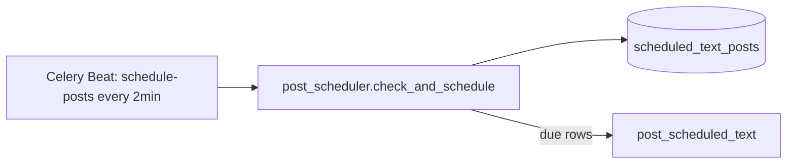

# TBCC Scheduler Architecture

How scheduled Telegram posts are stored, polled, and surfaced in the dashboard.

## Execution model

- **One Beat task** (`schedule-posts`) scans **all** `scheduled_text_posts` rows every ~2 minutes.
- Each dashboard row is **one DB record**, not one Celery Beat cron.
- Timing, pools, mirrors, caption rotation, and auto-pause are **per row**.
- Due rows are enqueued to `post_scheduled_text` on the Celery-Post worker.

## Row types

| Type | `interval_minutes` | Behavior |
|------|-------------------|----------|
| Recurring | `> 0` | Fires every N minutes after `last_posted_at` (or `scheduled_at` for first run) |
| One-shot | `NULL` / `0` | Fires once at `scheduled_at`; `sent_at` set when done |
| Campaign group | shared `campaign_group_id` | Lowest-id row is the scheduler anchor; siblings post together or random channel |

## Stack health (transport bar)

The dashboard **Scheduler Transport** bar aggregates **recurring active** rows only (`interval_minutes > 0`, excluding completed one-shots).

| Chip | Phase | Meaning |
|------|-------|---------|
| On track | `running` | Within interval window |
| Idle | `idle` | Recurring but never posted |
| Stalled | `stalled` | Past expected next run |
| Auto-paused | `paused` | `posting_auto_paused_at` set after send-failure streak |
| Stack | Beat + Celery-Post | From `GET /health/system` → `scheduling.beat_running`, `celery_post_worker_running`, focus-pause |

Poll interval: **15s** when stalled/paused or stack unhealthy; **30s** otherwise.

## Lean grouping

Dashboard **Lean** view groups rows by `scheduler_category` (or name-regex fallback):

| Category | Typical names |
|----------|---------------|
| `main_lane` | `* SCHEDULER`, Loot Room commons / network hubs |
| `bot_commands` | `AOF — bot commands — …` |
| `liveness` | `AOF — network liveness — …` |
| `promo_bulletin` | PACKS, Links Hub, cross-channel, celebrations |
| `manual` | User-created / unmatched |

Column added in migration `090_scheduler_category`. Seed paths in `aof_growth_hub`, `aof_network_liveness`, and `apply_growth_launch` set categories on create/update. Backfill: `scripts/backfill_scheduler_category.py`.

## Auto-pause

After `TBCC_SCHED_POST_AUTO_PAUSE_STREAK` consecutive send failures, the beat poller skips the row until cleared from the dashboard or via API. Fields: `send_failure_streak`, `posting_auto_paused_at`, `posting_auto_pause_reason`.

## Pool auto-post (separate from schedulers)

Content pools can have `auto_post_enabled` + `interval_minutes` for bare pool dumps between scheduler-captioned posts. These are **pool rows**, not `scheduled_text_posts` — they do not appear in the scheduler list.

**Dedicated Celery lanes (Windows full stack):**

| Worker | Queue | Tasks |
|--------|-------|-------|
| TBCC-Celery-Post-Scheduler | `post_scheduler` | `post_scheduled_text`, `drain_scheduled_post_queue` |
| TBCC-Celery-Post | `post` | `post_pool`, relay posts, etc. |

**Priority rules:**

- When any scheduler row is past due, `post_pool` tasks are purged from the post queue and pool auto-post is skipped for pools linked to overdue schedulers (`pool_id` on the row).
- Health auto-remediate runs `resume_scheduled_posting` when post queue depth ≥ `TBCC_POST_QUEUE_BACKLOG_THRESHOLD` (default **5**) or any scheduler is ≥ `TBCC_SCHEDULER_STALL_MINUTES` (default **15**) late.
- Tray/orchestrator **Restart** clears post Redis enqueue locks via `backend/scripts/clear_post_scheduling_redis.py`.

## Audit (read-only)

`scripts/audit_scheduler_rows.py` reports:

- Recurring rows with no `last_posted_at` in N+ days
- Duplicate scheduler names
- Sent one-shots older than N days

No automatic deletes. `apply_growth_launch.py` names remain the source of truth for seeded jobs.

## Key files

| Area | Path |
|------|------|
| Model | `app/models/scheduled_text_post.py` |
| Beat poller | `app/services/post_scheduler.py` |
| Worker task | `app/workers/poster_worker.py` |
| API | `app/api/scheduled_posts.py` |
| Category helper | `app/services/scheduler_category.py` |
| Dashboard transport | `dashboard/src/utils/schedulerPostStatus.ts` |
| Dashboard list | `dashboard/src/components/ScheduledPostsList.tsx` |
