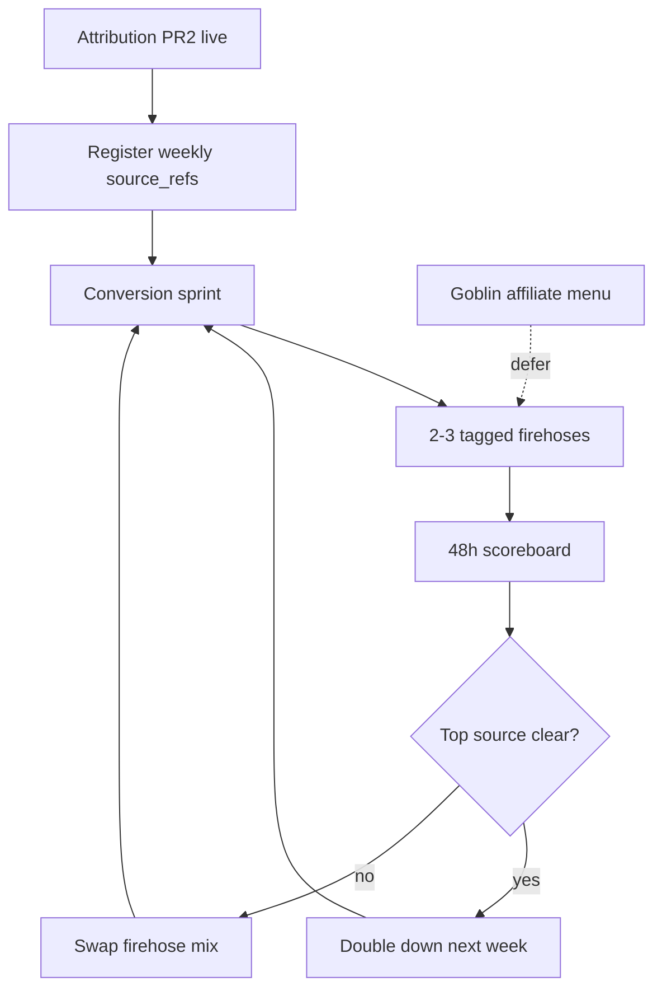

# Playbook: Traffic firehose + manufacturing Jul-burst weeks

**Date:** 2026-07-27  
**Status:** Operator + Frontier doctrine — **execute only after attribution PR2** (see `2026-07-27_deep-link-attribution-frontier.md`)  
**Lane:** Frontier designs campaigns; **Tray/operator** runs bursts; **Desktop Auto** wires tagged links + conversion sprint button

**Purpose:** Stop waiting for freak traffic. **Manufacture** the conditions that produced Jul 12–21 — multiple revenue streams, measurable sources, healthy conversion pipe — then **scale what wins**.

---

## What the Jul burst actually was

Not one trick. A **stacked scenario**:

```
Inbound (unknown source — likely warm/affiliate/addlist)
    → Channel/lane with Stars checkout visible (schedulers loud)
        → Taste hook (loot key 150⭐ or free pull / goblin)
            → Upsell (Main/VIP 500⭐) — jojobi bought 3 SKUs in 1h
                → Sale-announce FOMO → social proof → more subs
```

**What broke the flow (Jul 22+):**

| Failure | Effect |
|---------|--------|
| Telethon `AuthKeyDuplicatedError` | 155 failed posts vs 18 OK — CTAs starved |
| Dead LV loot gate | External traffic → dead room |
| Zero new sales | Sale-announce FOMO loop stopped |
| No source tags | Could not re-run whatever brought jojobi |

**Conversion sprint (2026-07-27)** restored stack layers 2–4. Layer 1 (traffic) + measurement still open.

---

## Revenue streams (not pick one — run a portfolio)

| Stream | Mechanism | TBCC surface | Burst lever |
|--------|-----------|--------------|-------------|
| **Stars subs** | Telegram native | `@aofsubscriptions_bot`, channel checkout buttons | Conversion sprint, stars-bait DMs, sale FOMO |
| **Loot keys** | Low-ticket SKU | `/loot`, `bait_loot`, loot bot | Same + jojobi-style ladder (key → main) |
| **Linkvertise** | Gate revshare | Channel gates, `prompt_gate` | Tagged LV → Loot Room; weekly gate push |
| **Affiliate AI bots** | Outbound revshare | `links_hub_ai`, roll footers, (future goblin menu) | Rotation sync; co-promo posts |
| **Gumroad / crypto** | Off-platform VIP | Mainhub pin, `cm{N}` checkout | Mainhub liveness |
| **Referral** | User `ref_*` | Payment bot | Incentivize sharers once attribution works |

**Arbitrage framing:** acquire attention cheap (X teaser, LV completion, addlist, affiliate traffic) → monetize on **your** Telegram RPG/loot economy (Stars + keys + affiliates).

---

## The “manufactured burst” recipe (weekly operator ritual)

Run **every Sunday** (or after any poster incident). Each step uses a **registered `source_ref`** once attribution ships.

### Phase 0 — Pipe health (5 min)

```bash
curl -s https://api.powercore.app/health
curl -s https://api.powercore.app/growth-hub/status | jq '[.schedulers[]|select(.ok)]|length'
# worker_post Up on island; overdue scheduled posts trending down
```

If poster sick → fix before spending traffic (see `2026-07-25_revenue-pipe-p0-and-loot-gate_report.md`).

### Phase 1 — Conversion sprint (one click or curl)

```
POST /growth-hub/conversion-sprint
```

Stars-bait + album checkout + bulletin sync + blast to 14 channels.  
**Tag:** internal campaign `src_ops_sprint_wkNN`.

### Phase 2 — Pick 2–3 firehoses (not 10)

Rotate weekly; never run all at once until attribution proves capacity.

| # | Firehose | Tagged entry | Effort | Best for |
|---|----------|--------------|--------|----------|
| **A** | **LV loot gate burst** | `src_lv_loot_wkNN` | Low | Cold external → Loot Room |
| **B** | **X/Buffer hub teaser** | `src_x_hub_wkNN` | Low | Clearnet → `@aofmainhub` |
| **C** | **Stars-bait DM wave** | `src_bait_batch_wkNN` | Auto | Warm bot contacts (21+ pool) |
| **D** | **Addlist / cross-lane pin** | `src_ch_addlist_wkNN` | Med | Existing Telegram graph |
| **E** | **Free pull CTA post** | `src_loot_free_wkNN` | Low | `t.me/aof_lootgod_bot?start=loot_free` |
| **F** | **Affiliate co-post** | `src_aff_<partner>_wkNN` | Med | Partner bot traffic |

**Week 1 recommendation:** **A + B + C** (external + warm + proof loop).

### Phase 3 — Manufacture “jojobi scenario” (intentional ladder)

Design for **multi-SKU session**, not single 500⭐ sub:

1. **Low friction first:** loot key 150⭐ or free pull (`loot_free` / goblin claim).
2. **DM upsell within 10 min:** loot bot follow-up or stars-bait `bait_vip` (already in rotation).
3. **Sale announce** on first purchase — FOMO in all lanes (auto today).
4. **Channel checkout** on every lane post (conversion sprint ensures this).

**Do not** discount Main to win key buyers — jojobi paid full ladder.

### Phase 4 — FOMO flywheel (kickstart if zero sales)

Chicken-and-egg: sale announce needs a sale. Options (Frontier must lock honesty doctrine):

- Operator test purchase (smallest SKU) to seed announce — real transaction.
- Milestone announce (already have `celebrate-first-sub`) — not fake buyer counts.
- **Never** fabricate “someone just bought” without fulfillment.

### Phase 5 — Read the scoreboard (48h after burst)

```bash
curl -s "https://api.powercore.app/analytics/bots/funnel?days=7"
curl -s "https://api.powercore.app/analytics/income/entries?days=7&limit=10"
# After attribution PR:
# jq '.attribution.conversions_by_source'
```

**Scale rule:** Double effort on top `source_ref` next week; kill bottom two.

---

## Firehose deep dives

### A — Linkvertise → Loot Room (external arbitrage)

- Gate: `loot` slug → `https://telegram.me/+97f4Crv3G1RkMGU5` (fixed 2026-07-25).
- Push gate in **one** off-platform post (X alt account, forum sig, partner) per week.
- LV earns on completion; **your** Stars earn after they join + hit bot/channel CTA.
- **Failure mode:** dead destination — always verify gate before burst.

### B — X / Buffer clearnet hub

Doctrine: `TBCC_X_USE_LINKVERTISE=0` default — clearnet `telegram.me/aofmainhub` or `loot_free` on X.  
One teaser/week; Buffer `addToQueue`; tag `src_x_hub_wkNN`.

### C — Stars-bait DMs (warm firehose)

Island env (2026-07-27): `BATCH=10`, `INTERVAL_MIN=30` → ~480 DMs/week max.  
Not cold traffic — **reactivates** everyone who already touched AOF bots.  
Essential for repeat bursts; insufficient alone for jojobi-scale cold whales.

### D — Telegram graph (addlist / lane network)

You operate **14+ lanes** with checkout on schedulers. Burst = bulletin post + pin + addlist cross-link.  
High leverage for **Telegram-native** arbitrage (users already on platform).

### E — Loot RPG hook (`loot_free`)

Game differentiation: RNG tier card → DM album. Use clean art + `loot_free` in every burst post.  
Converts curiosity → rolls → keys → subs.

### F — Affiliate partners (Undress, DrawAI, …)

Revshare side income; can feed **inbound** if partners push back. Track `src_aff_*` separately from Stars.

---

## What NOT to do (Jul cliff lessons)

| Anti-pattern | Why |
|--------------|-----|
| Scale posts while `worker_post` broken | Volume without CTAs = noise |
| Multiple LV destinations per message | Doctrine + user confusion |
| Rely on goblin menus for volume | ~3 spawns/day — optimization only |
| Run bursts without `source_ref` | Cannot repeat jojobi |
| Sync Telethon post from API container | Session lock — use Celery `worker_post` / Bot API for goblin |
| Home + island duplicate bots | 409 / session death |

---

## Success metrics (Jul-burst equivalence)

| Metric | Jul burst band | “Back in flow” target |
|--------|----------------|------------------------|
| Stars subs / week | ~8–11 in 10 days | **≥3/week** sustained |
| Multi-SKU buyers | jojobi, B B, Niv | **≥1** multi-buy / week |
| `subscription_created` by source | unknown | **≥2 sources** contributing |
| Post failure rate | spiked Jul 15–22 | **<10%** failed post events |
| Sale announces / week | tied to sales | **≥1** (proves FOMO loop alive) |

---

## Dependency graph



---

## Paste block for Frontier (traffic + attribution together)

```
Read:
- tbcc/docs/handoffs/2026-07-27_deep-link-attribution-frontier.md
- tbcc/docs/handoffs/2026-07-27_traffic-firehose-playbook.md (this file)
- docs/AOF_PLACEMENT_DOCTRINE.md

Task:
1. Validate weekly burst recipe (Phase 0-5) — adjust for honesty doctrine on FOMO kickstart
2. Pick default Week-1 firehose mix (recommend A+B+C)
3. Define campaign registry entries for wk30 example (src_lv_loot_wk30, src_x_hub_wk30, …)
4. Confirm multi-SKU ladder aligns with loot economy docs — no doctrine conflicts
5. Output: 1-page operator checklist + “manufactured burst” success criteria

No code. Coordinate with attribution report.
```

---

## Related handoffs

| Doc | Role |
|-----|------|
| `2026-07-27_deep-link-attribution-frontier.md` | **P0** — measurement |
| `2026-07-27_goblin-affiliate-menu-frontier.md` | Deferred — spawn-time affiliate |
| `2026-07-25_revenue-pipe-p0-and-loot-gate.md` | Poster/session health |
| `2026-07-26_relay-bot-api-phase5-plan.md` | Future — relay off Telethon |

---

## Operator one-liner

**Measure → sprint → two tagged firehoses → ladder SKUs → read sources → repeat winners.**  
That is how you manufacture another Jul week instead of hoping for one.
